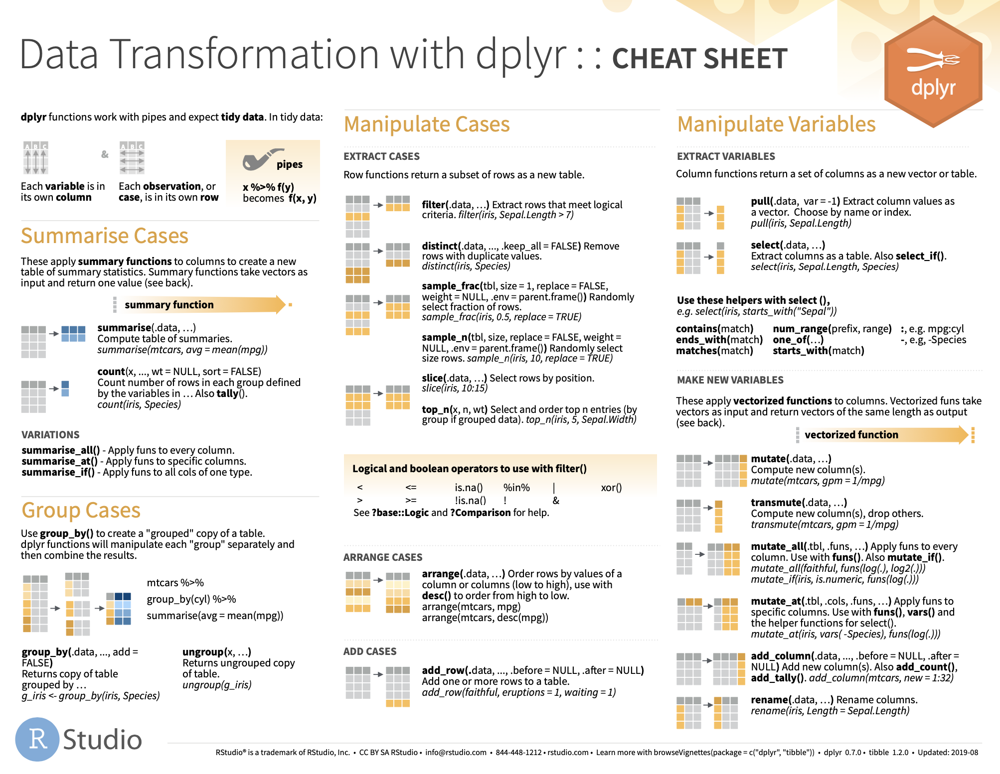

```{r setup, include=FALSE}
knitr::opts_chunk$set(echo = FALSE)

```


## Outline for today 


- Today we complete the Transform $\rightarrow$ Visualize $\rightarrow$ Model cycle.
   
<figure class="image">
<p float="center">
   
</p>
<figcaption><small> From R for Datas Sience, Chapter 6.
</small> </figcaption>
</figure>

- - We will return to our ${\tt tcga\_brca}$ breast cancer transcriptomics dataset.

- Transformations select specific subsets of the data for visualization and modelling.

## Initialize our sesson

- We are going to focus on a package called ${\tt dplyr}$ today. It's also part of the ${\tt tidyverse}$. 

- If ${\tt ggplot2}$ is the grammar of plots, ${\tt dplyr}$ is the grammer of data transformation.

```{r echo=TRUE, fig.align='left', collapse=TRUE, class.source="watch-out"}
library(tidyverse)
#load(data/small_brca.Rdata)    # load the BC dataset
#View(small_brca)                # handy to have that open for exploration
```

## Note the class of the different attributes

- There are three classes here: ${\tt character (chr)}$, ${\tt lgl (logical)}$ and ${\tt dbl (double)}$. Note that ${\tt double}$ is the same as ${\tt numeric}$. Historical anomaly. 

```{r echo=TRUE, fig.align='left', collapse=TRUE, class.source="watch-out"}
#small_brca               
```

- There are other classes not used here. We will see ${\tt fctr (factors)}$ later.

## ${\tt dplyr}$ cheat sheet (part 1)

- __variables__ are columns; __observations__ are rows.

<figure class="image">
<p float="center">
   
</p>
</figure>


## ${\tt dplyr}$ cheat sheet (part 2)

- Available [here](https://github.com/rstudio/cheatsheets/blob/master/data-transformation.pdf)


<figure class="image">
<p float="center">
   
</p>
</figure>

## Points of Reflection


## BIOL480 

&copy; M Hallett, 2020 Concordia University


